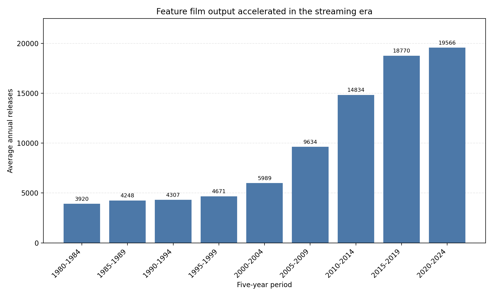
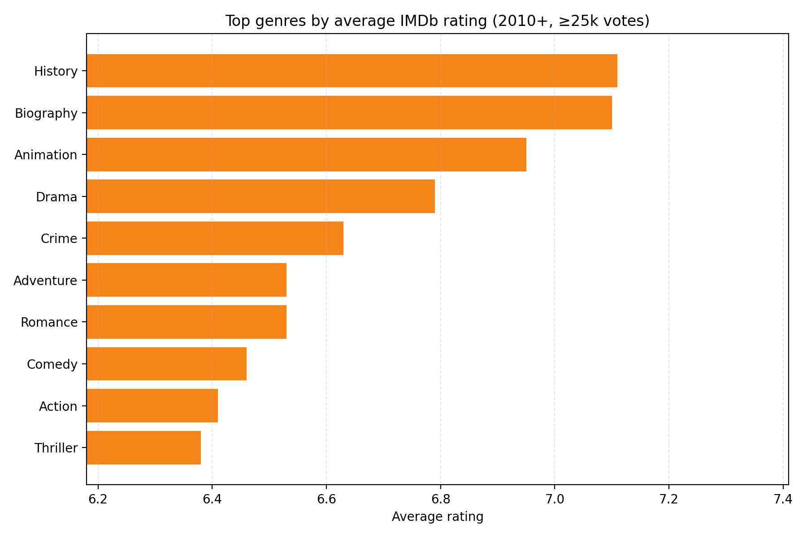
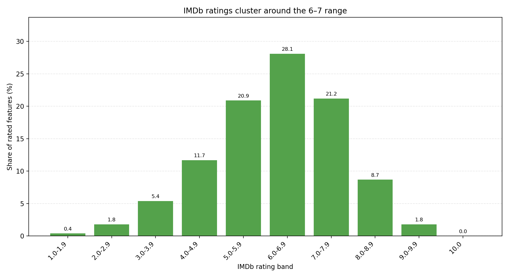
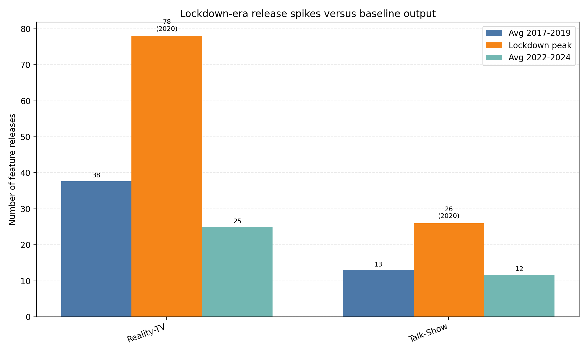
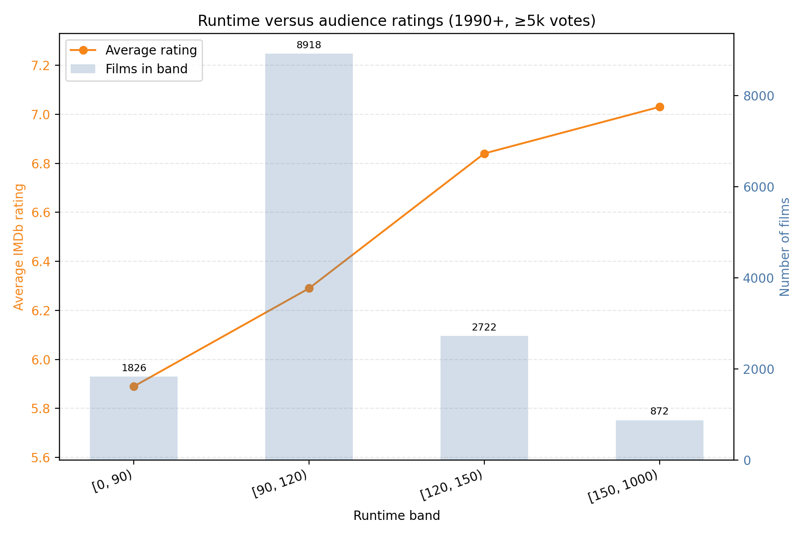

# IMDb Movie Trends Workshop

This project downloads the public IMDb basics and ratings datasets, cleans the feature-film catalogue, and generates a narrative report highlighting multi-decade production, audience taste, and lockdown-era genre patterns. All tables live in [`reports/imdb_report.md`](reports/imdb_report.md); the companion charts below visualise each insight at a glance.

## Getting started

1. Install the Python dependencies:
   ```bash
   pip install -r requirements.txt
   ```
2. Run the analysis pipeline (downloads datasets on the first run, reuses them afterwards):
   ```bash
   python scripts/run_analysis.py --data-dir data
   ```
   Charts are written to `reports/figures/` and the Markdown summary is refreshed in `reports/imdb_report.md`.

## Key findings

### Streaming-era output surge

Feature-film production more than quadrupled between the early 1980s and the streaming era. The average five-year release volume climbed from roughly **3,900 titles per year in 1980–1984 to almost 19,600 in 2020–2024**.



### Genres large audiences adore

Recent mainstream hits (2010 onward, ≥25k votes) show audiences gravitating toward prestige non-fiction alongside animation. **History and Biography films average just over 7.1 on IMDb, with Animation close behind at 6.95**, and each cleared at least 100 sizeable releases in the last decade.



### Ratings cluster around the middle

IMDb scores concentrate around the 6–7 range: **28.2% of rated features sit in the 6.0–6.9 band and 21.2% in 7.0–7.9**, while perfect 10s are practically nonexistent. Extremes below 2.0 represent just 0.4% of titles.



### Lockdown-era release spikes

Only two genres met the study’s spike criteria during the 2020 lockdown: **Reality-TV jumped to 78 releases—2.1× the 2017–2019 average—while Talk-Show output doubled to 26 films** before easing in the recovery years.



### Runtime and audience reception

Longer tentpoles earn slightly better scores, though not dramatically so. **Films running 150+ minutes average about 7.0**, compared with **5.9 for sub-90-minute releases**, even as the bulk of studio output stays in the 90–120 minute band.



### Hypothesis fact-checks

The generated report now contrasts published hypotheses with the computed dataset. Each table lists the stated expectations next to the observed values, highlights the difference (Δ = actual − expected), and marks whether the claim holds.

## Reproducing or extending the analysis

The pipeline is written in pure pandas and matplotlib so it is easy to tweak thresholds or add new sections. Open `scripts/run_analysis.py` to adjust window sizes or genre filters, rerun the script, and the report plus charts will update automatically.
